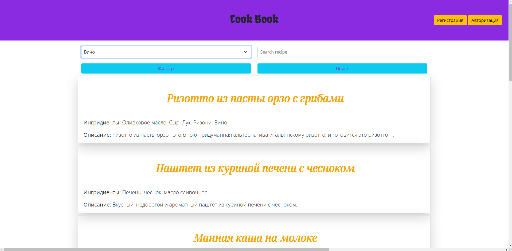
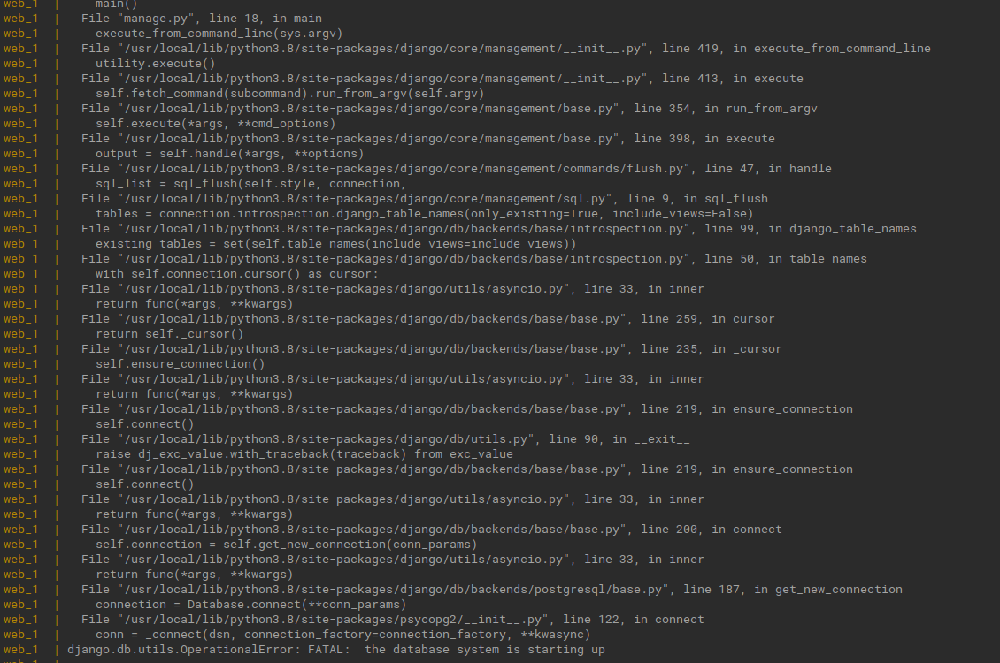
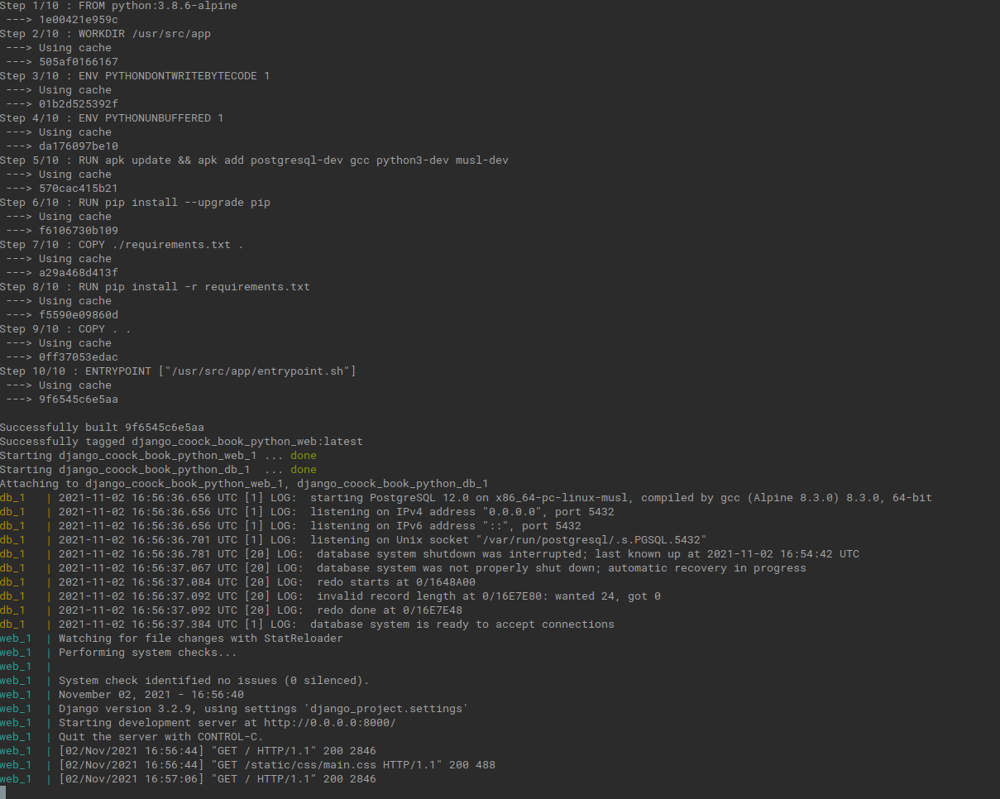

# coocking book
## Summary: The project includes a cookbook app, 
frontend: bootstrap standard templates, html, css, 
backend: django, postgres, 
server: docker cluster.

#### :warning: Note: add_recipe and add_ingridient in betta.

### Note:
:warning: To install you need installed before: docker, docker compose

### :star: Instalation steps:
1) clone project and change to directory.
#### Create a .env.dev file and write this config into it
#### (if necessary, you can replace the necessary parameters here and in docker-compose.yaml):
DEBUG=1 
SECRET_KEY=foo 
ALLOWED_HOSTS=localhost 127.0.0.1 [::1] 
POSTGRES_ENGINE=django.db.backends.postgresql 
POSTGRES_DB=django_cook 
POSTGRES_USER=django_user 
POSTGRES_PASSWORD=django_password 
POSTGRES_HOST=db 
POSTGRES_PORT=5432 
#### To build and run project.
2) docker-compose up --build
Create tables on your database.
3) sudo docker-compose exec web python manage.py makemigrations
4) sudo docker-compose exec web python manage.py migrate
5) sudo docker-compose exec web python manage.py makemigrations book
6) sudo docker-compose exec web python manage.py migrate book
7) sudo docker-compose exec web python manage.py loaddata fixtures.json
8) sudo docker-compose exec web python manage.py createsuperuser
### :warning:Note: 
if you see a similar picture after all steps or don't see ingridient filter:

Stop the project runing(ctrl-c) and rerun step 2
until you see something like this.

